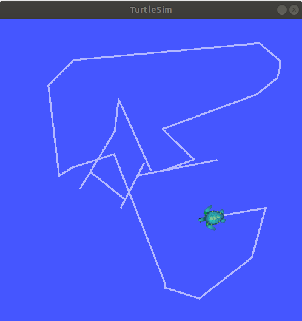
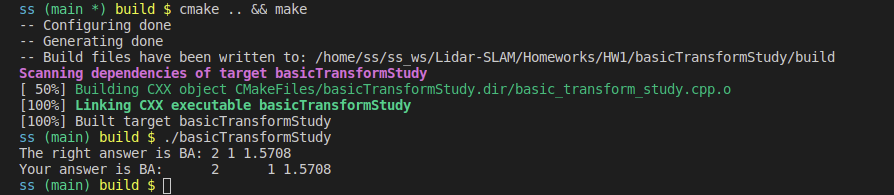

# Lidar SLAM 

> by: SS47816

## Homework 1

### Task 1: Linux

#### Linux Commands

1. `cd`: change directory
2. `ls`: list all the files in the current directory
3. `source`: execute the content of a file

#### Vim

Vim is a terminal text editor that allows you to edit any file

1. Insertion: key in `i` in viewing mode to change to **insertion mode** and start inserting your text
2. Deletion: use backspace as usual, or key in `dd` in viewing mode to delete a whole line
3. Quit: key in `:wq` in viewing mode

#### Zipping and Unzipping

```bash
# zipping
zip [options] myfile
# unzipping
unzip [options] myfile.zip

# Or use `tar`
tar -zcvf myfile.tgz .
tar -zxvf myfile.tgz
```


### Task 2

The Turtle Sim was run successfully:




### Task 3

**Given: **
$$
Robot\ A's\ Pose: [x_a, y_a, \theta_a]^T \\
Object\ B's\ Pose: [x_b, y_b, \theta_b]^T \\
(in\ World\ Frame,\ O)
$$
**Solution for Question 1:** 

Transformation Matrix from A to World's Frame:
$$
T^O_A = 
\begin{bmatrix} 
\cos(\theta_a) & -\sin(\theta_a) & x_a \\
\sin(\theta_a) & \cos(\theta_a) & y_a \\
0 & 0 & 1 \\
\end{bmatrix}
$$

Transformation Matrix from B to World's Frame:
$$
T^O_B = 
\begin{bmatrix} 
\cos(\theta_b) & -\sin(\theta_b) & x_b \\
\sin(\theta_b) & \cos(\theta_b) & y_b \\
0 & 0 & 1 \\
\end{bmatrix}
$$

Transformation Matrix from B to A:
$$
\begin{align*}
T^A_B &= T^A_O T^O_B \\
&= {T^O_A}^{-1} T^O_B
\end{align*}
$$
Therefore, the object's pose in the robot's frame is given by:
$$
\begin{align*}

\begin{bmatrix} 
x_{b,A} \\
x_{b,A} \\
\theta_{b,A}
\end{bmatrix}

&= \begin{bmatrix} 
T^A_B(0,2) \\
T^A_B(1,2) \\
atan2(T^A_B(1,0), T^A_B(0,0)) \\
\end{bmatrix} \\

\end{align*}
$$


**Solution for Question 2:** 

After the motion, the Robot's Frame transformation to its previous Frame can be represented as:
$$
T^A_{A^\prime} = 
\begin{bmatrix} 
\cos(\theta_d) & -\sin(\theta_d) & d \\
\sin(\theta_d) & \cos(\theta_d) & 0 \\
0 & 0 & 1 \\
\end{bmatrix}
$$
Thus, transformation matrix from B to A is given by:
$$
\begin{align*}
T^{A^\prime}_B &= T^{A^\prime}_A T^A_O T^O_B \\
&= {T^A_{A^\prime}}^{-1} {T^O_A}^{-1} T^O_B
\end{align*}
$$
Now the object's pose in the new frame is given by:
$$
\begin{align*}

\begin{bmatrix} 
x_{b,A^\prime} \\
x_{b,A^\prime} \\
\theta_{b,A^\prime}
\end{bmatrix}

&= \begin{bmatrix} 
T^{A^\prime}_B(0,2) \\
T^{A^\prime}_B(1,2) \\
atan2(T^{A^\prime}_B(1,0), T^{A^\prime}_B(0,0)) \\
\end{bmatrix} \\

\end{align*}
$$


### Task 4

The code implemented for transforming Robot B to coordinate A:

```c++
Eigen::Matrix3d TOA;
TOA << cos(A(2)), -sin(A(2)), A(0),
	   sin(A(2)),  cos(A(2)), A(1),
           0,          0,      1;

Eigen::Matrix3d TBA = TBO * TOA;
BA << TBA(0,2), TBA(1,2), atan2(TBA(1,0), TBA(0,0));
```

And the result was `2, 1, 1.5708`:



