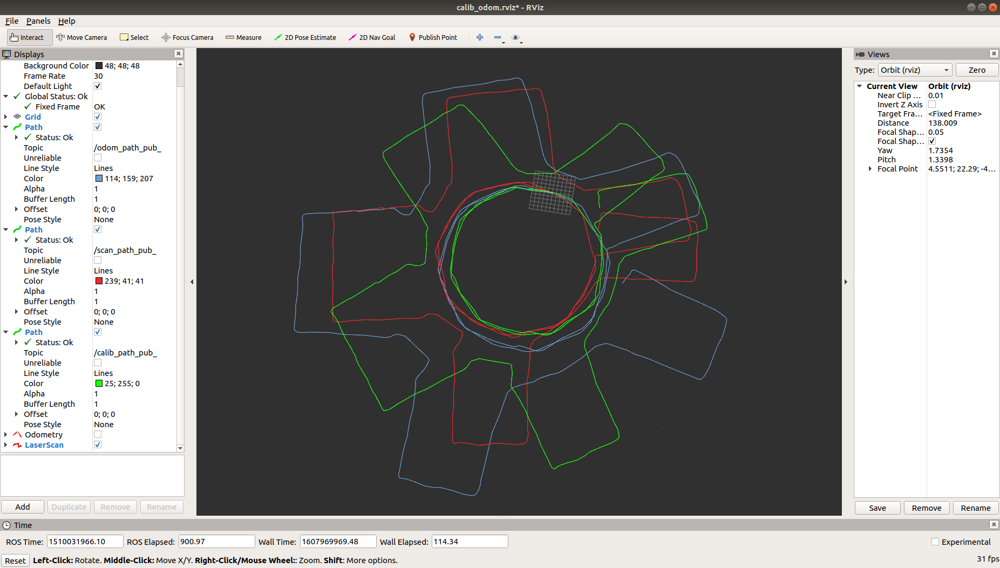
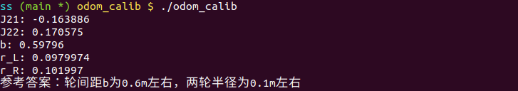

# Lidar SLAM

> by: SS47816

## Homework 2: Odometry Calibration

### Task 1: Linear Method

After implementing the code, the results are shown here: 

 Blue Trajectory:  Recorded by Odom

 Red Trajectory:  Recorded by Lidar

 Green Trajectory:  After Calibration

### Task 2: Model Based Method

The result I got was: 

### Task 3: 