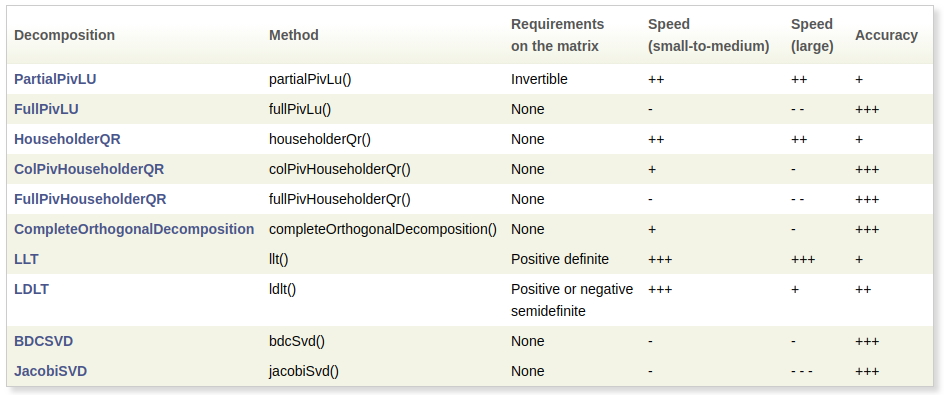

# Lidar SLAM

> by: SS47816

## Homework 2: Odometry Calibration

### Task 1: Linear Method

After implementing the code, the results are shown here: 

 Blue Trajectory:  Recorded by Odom

 Red Trajectory:  Recorded by Lidar

 Green Trajectory:  Calibrated

---

### Task 2: Model Based Method

The result I got was: 

---

### Task 3: Solving Ax = b

Generally there are three types of methods for solving for the least square solution of a overdetermined system Ax = b. 

Depending on the trade-off between **speed** vs. **accuracy**, different methods can be selected for different purposes:

#### SVD Decomposition

* Most accurate
* Longer time

#### QR Decomposition

* Average accuracy
* Average speed

#### Normal Equations

* Least accurate
* Very fast

There are some methods that can only be use in some special cases such as the LLT, which requires the matrix A to be **positive definite**. 

The full list of supported solvers in Eigen is listed [here](http://eigen.tuxfamily.org/dox/group__TutorialLinearAlgebra.html):

---

### Task 4: Designing Calibration Method for Odometry & Lidar

#### Description of Method

1. Retrive the odometry readings from both wheel encoders (**Predicted Value**)
2. Retrive the Lidar odometry from a selected Lidar-Odom method (such as LOAM)
3. The Lidar odometry will be passed to a **Kalman Filter** (e.g. an EKF), with it's standard deviation as the covariance matrix to produce a filtered Lidar odometry data as the ground truth (**Observed Value**)
4. The calibration node subscribes to both topics and record the data for a certain period of time (e.g. 20s), or a certain distance (e.g. 10m)
5. Once it has collected enough amount of data, the calibration process will be triggered to solve for the correction matrix using the **Model-based** method (differential drive, two wheels only)
6. The above procedure will be conducted on a regular basis or upon requested

#### Assumptions

1. The Lidar is mounted at the centre of the robot platform
2. There's no slipping between wheels (tires) and the ground
3. The ground is flat
4. The Lidar plane is always horizontal to the ground plane (map plane)
5. There's no deformation on the wheels (or the deformation is always evenly spread over the wheel circumference)
6. The Lidar Odometry data after Kalman Filter is close to accurate (ground truth)

#### Construction of Ax = b

1. The wheel encoder odometry data $\omega_{Li}, \omega_{Ri}$ and the Lidar odom data after the Kalman Filter (in Step 3) $S_{\theta i}$ will be use to contruct the first linear system of equations to solve for $[J_{21} J_{22}]^T$
   $$
   \begin{bmatrix} 
   \omega_{L0} \triangle T_0 & \omega_{R0} \triangle T_0 \\
   \omega_{L1} \triangle T_1 & \omega_{R1} \triangle T_1 \\
   \vdots & \vdots \\
   \omega_{Ln} \triangle T_n & \omega_{Rn} \triangle T_n \\
   \end{bmatrix}
   \begin{bmatrix}
   J_{21} \\
   J_{22}
   \end{bmatrix}
   =
   \begin{bmatrix}
   S_{\theta 0} \\
   S_{\theta 1} \\
   \vdots \\
   S_{\theta n}
   \end{bmatrix}
   $$
   
2. The second system of linear equations is constructed by:
   $$
   C_{xi} = {1 \over 2} (-J_{21}\omega_{Li} + J_{22}\omega_{Ri}) \triangle T_i \cos(\theta_i) \\
   C_{yi} = {1 \over 2} (-J_{21}\omega_{Li} + J_{22}\omega_{Ri}) \triangle T_i \sin(\theta_i) \\
   where\ \theta_i = \theta_{i-1} + (J_{21}\omega_{Li} + J_{22}\omega_{Ri}) \triangle T_{i-1} \\
   \begin{bmatrix} 
   C_{x0} \\
   C_{y0} \\
   \vdots \\
   C_{xn} \\
   C_{yn} \\
   \end{bmatrix}
   b_{wheel}
   =
   \begin{bmatrix}
   S_{x0} \\
   S_{y0} \\
   \vdots \\
   S_{xn} \\
   S_{yn} \\
   \end{bmatrix}
   $$
   
3. Finally the wheel base $b_{wheel}$ is solved, and the left & right wheel radii can be conputed by:
   $$
   r_L = -J_{21} \cdot b_{wheel} \\
   r_R = J_{22} \cdot b_{wheel}
   $$