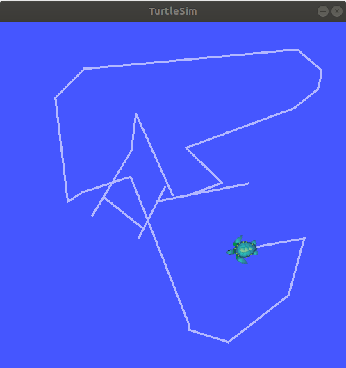
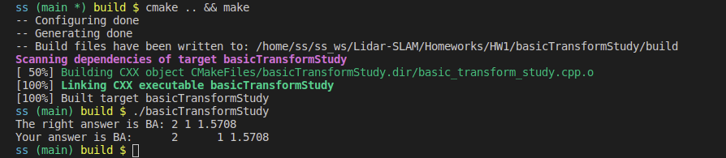

# Lidar SLAM 

> by: SS47816

## Homework 1

### Task 1: Linux

#### Linux Commands

1. `cd`: change directory
2. `ls`: list all the files in the current directory
3. `source`: execute the content of a file

#### Vim

Vim is a terminal text editor that allows you to edit any file

1. Insertion: key in `i` in viewing mode to change to **insertion mode** and start inserting your text
2. Deletion: use backspace as usual, or key in `dd` in viewing mode to delete a whole line
3. Quit: key in `:wq` in viewing mode

#### Zipping and Unzipping

```bash
# zipping
zip [options] myfile
# unzipping
unzip [options] myfile.zip

# Or use `tar`
tar -zcvf myfile.tgz .
tar -zxvf myfile.tgz
```


### Task 2

The Turtle Sim was run successfully:




### Task 3

Assuming Robot: (x_a, y_a, theta_a), Object: (x_b, y_b, theta_b), 

1. The object's coordinate in Robot's frame is given by: ( , , )
2. After the motion, the object is located at: ( , , )


### Task 4

The code implemented for transforming Robot B to coordinate A:

```c++
Eigen::Matrix3d TOA;
TOA << cos(A(2)), -sin(A(2)), A(0),
sin(A(2)),  cos(A(2)), A(1),
0,          0,      1;

Eigen::Matrix3d TBA = TBO * TOA;
BA << TBA(0,2), TBA(1,2), acos(TBA(0,0));
```

And the result was `2, 1, 1.5708`:



